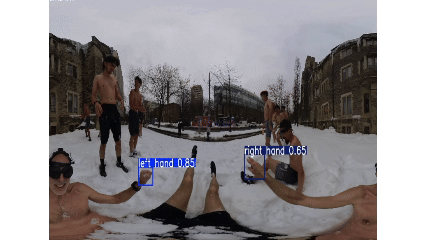

# MindMesh-SnowballTrajectory

**Predict where a thrown snowball will land from Insta360 video, using hand and arm throw trajectory calculation.**

## Approach

A YOLOv8 detector trained on 500+ annotated frames recognizes six functional classes per frame: `left/right hand` (just the hand), `left/right arm - windup` (the whole arm at the start of a throw, shoulder→hand), and `left/right arm - finish throw` (the whole arm at release). The shipped weights file `runs/detect/hand-throw2/HandV2/weights/best.pt` actually carries `nc=8` — indices 3 and 7 are stray legacy slots from an earlier training run that are ignored at runtime, so the right-side throw classes live at 4/5/6 rather than 3/4/5. `CLASS_NAMES` in `test_model.py` patches the names in the loaded model so labels render correctly.

The trajectory pipeline runs on top of that detector as a two-pass process — an inference pass that builds per-frame detections and a list of raw throw events, followed by a resolution pass that turns each raw event into precise windup/release pixels and integrates a trajectory:

1. **Per-hand state machine (inference pass)** — for each hand (left, right), the first `arm - windup` detection locks in the windup arm bbox and frame index; the next `arm - finish throw` detection on the same side is treated as the release and a raw event is emitted. A windup that never resolves into a finish-throw is dropped after `MAX_THROW_FRAMES` and start→end pairs closer than `MIN_THROW_FRAMES` are rejected. Arm classes drive *timing* only — they decide when the throw starts and ends.
2. **Two-signal pixel resolution (resolution pass)** — the windup and release **pixels** are sourced from the plain-hand classes (`0 = left hand`, `4 = right hand`), not from the arm bbox centers. For each raw event:
   - **Preferred**: take the matching-side hand bbox center on the trigger frame, accept it only if it lies within the corresponding arm bbox (windup) or the expected release quadrant (finish throw). If no hand bbox fires on the trigger frame, expand outward to ±`HAND_SEARCH_WINDOW_FRAMES` frames; the closest in time wins. The two-pass design (state machine first, pixel resolution second) is what lets the release-side search look *forward* into post-release frames, where motion blur subsides and the plain-hand class fires more reliably.
   - **Finish-throw fallback** uses a tight spatial prior derived from this footage: the **left hand at release always sits in the top-right quadrant** of the left-arm finish-throw bbox, and the **right hand at release always sits in the top-left quadrant** of the right-arm finish-throw bbox (the thrower faces the camera and throws forward, so the hand is above the shoulder and on the outer side of the arm at release). When no plain-hand bbox is found in the search window, the release pixel falls back to the centroid of that quadrant — strictly better than arm-bbox center, because it uses a trained-data-derived spatial prior rather than a generic geometric heuristic.
   - **Windup fallback** is the arm bbox center; windup pose is more variable and no analogous quadrant prior is asserted.
   - The toggle `USE_HAND_BBOX_REFINEMENT` reverts to the old arm-center-to-arm-center behavior for A/B comparison.
3. **Equirectangular unprojection to 3D** — Insta360 footage is exported as an equirectangular projection (`x → azimuth φ ∈ [-π, π]`, `y → elevation θ ∈ [π/2, -π/2]`). The resolved windup and release pixels are each converted to a unit ray and lifted onto a sphere of radius `ASSUMED_THROW_DISTANCE_M` around the camera, giving a 3D world point for both.
4. **Initial 3D velocity** — `v = (release₃D − windup₃D) / Δt`, multiplied by `RELEASE_VELOCITY_GAIN` to scale the average windup-to-release motion up to a peak release speed. `Δt` comes from the source video's FPS. An upward loft component is then added: `vy += √(vx² + vz²) · tan(LAUNCH_ANGLE_BOOST_DEG)`. Real throws launch with upward arc, but the windup→release tangent alone gives near-flat `vy` and the ball dives too quickly — the boost reintroduces loft proportional to horizontal speed. This whole step also avoids the "constant angular velocity" failure mode where forward throws appear to sweep across the entire frame, because angular velocity now correctly *decreases* as the ball moves further from the camera.
5. **3D projectile model** — the throw is integrated in world space with real gravity acting on `+y` (down):
   - `p(t) = p_release + v · t + ½ · g_vec · t²` where `g_vec = (0, −9.81, 0)`
   At each timestep (`TRAJ_STEP_S`, capped at `TRAJ_MAX_S`) the 3D position is reprojected back to an equirectangular pixel via `world_to_pixel`. The simulation stops when the world-`y` coordinate crosses `−CAMERA_HEIGHT_M` (the assumed ground), with linear interpolation to the exact crossing point.
6. **Visualization** — interactive frame stepper. Orange polyline traces the simulated trajectory from release to landing; a red filled dot (white-ringed) marks the predicted impact point; green and blue dots mark the resolved windup and release pixels; an overlay shows release speed (m/s) and launch angle. The per-throw console line additionally prints the *source* of each pixel (`hand-bbox` / `arm-center` / `quadrant`) so you can tell at a glance when a throw fell back to a fallback path. Polyline segments that cross the equirectangular seam are skipped to avoid spurious cross-frame lines, and any marker whose true coordinate falls outside the frame is clamped to the nearest edge so it always renders (the landing label switches to `LAND (off-frame)` in that case). On macOS frames are read on-demand from the source video (annotations redrawn from cached detection arrays) to avoid blowing out RAM on high-res 360 footage; on Windows the annotated frames from `r.plot()` are cached up front for fast scrubbing.

### Controls

The viewer pre-runs inference over the whole clip, then drops into a frame-by-frame viewer. `STEP_THROUGH_MODE = True` enables manual stepping (default on macOS); `False` autoplays at 0.5x real-time (default on Windows).

- `2` — next frame
- `1` — previous frame
- `q` — quit

### Tunable constants (`test_model.py`)

- `ASSUMED_THROW_DISTANCE_M` — meters from the camera to the thrower's hand. Default `0.5`. Sets the radius of the sphere we lift the hand pixels onto. Larger → larger absolute throw velocities for the same angular hand motion → longer trajectories.
- `CAMERA_HEIGHT_M` — meters from the camera to the ground. Default `1.5`. The trajectory terminates when world `y` drops below `−CAMERA_HEIGHT_M`.
- `GRAVITY_M_PER_S2` — real gravity, default `9.81`. No reason to change unless modelling another planet.
- `RELEASE_VELOCITY_GAIN` — multiplier on the windup→release average velocity to approximate peak release speed. Default `7.0`. Raise if throws fall too short, lower if they overshoot.
- `LAUNCH_ANGLE_BOOST_DEG` — extra upward loft added to the release velocity, as an angle above horizontal. Default `25.0`. Compensates for the windup→release tangent being near-flat in real footage; without it, the projectile dives too quickly.
- `TRAJ_STEP_S` / `TRAJ_MAX_S` — integration timestep and time cap for the 3D projectile sim. Defaults `1/60 s` and `4.0 s`.
- `USE_HAND_BBOX_REFINEMENT` — when `True` (default), windup/release pixels come from the plain-hand classes with the temporal search window and finish-throw quadrant prior described above; when `False`, they revert to the raw arm bbox centers (legacy behavior). A/B-toggle this on the same clip to measure how much the refinement changes predicted speed and landing.
- `HAND_SEARCH_WINDOW_FRAMES` — how many frames forward and backward of the windup/finish trigger to search for a co-firing plain-hand detection. Default `3` (≈50 ms at 60 fps — long enough to bridge a single missed detection without picking up an unrelated hand pose).
- `MIN_THROW_FRAMES` / `MAX_THROW_FRAMES` — minimum frame gap for a valid `start→end` pairing, and how long a stale windup is held before being cleared. Defaults `2` and `20`.
- `POLYLINE_THICKNESS` / `LANDING_DOT_RADIUS` / `WINDUP_RELEASE_DOT_RADIUS` — visibility knobs for the orange path and the colored dots.
- `LANDING_HOLD_FRAMES` — how many frames the landing dot stays visible after release. Default `60`.
- `STEP_THROUGH_MODE` — manual stepper vs. autoplay.
- `INFER_DEVICE` / `INFER_IMGSZ` — `"cpu"` / `416` on macOS to avoid OOM; `0` (CUDA) / `640` on Windows for full-res inference.

## Results

- Trained YOLOv8n on 500+ annotated frames, evaluated on a held-out validation split — the detector reliably localizes both hands and fires `arm - windup` / `arm - finish throw` events at the correct moments in real-world outdoor footage.
- The full detect → equirectangular-unprojection → 3D-projectile pipeline runs frame-by-frame on RTX 3060 Ti hardware at real-time playback rates; the macOS frame stepper preprocesses the clip on CPU and then advances at user-controlled pace.
- Predicted landing dot tracks observed snowball impact points across multiple test throws after one-time calibration of `ASSUMED_THROW_DISTANCE_M`, `RELEASE_VELOCITY_GAIN`, `LAUNCH_ANGLE_BOOST_DEG`, and `CAMERA_HEIGHT_M`.

## Context

Built as part of BCI-XR research under Prof. Steve Mann at the University of Toronto (Feb 2026 – present), contributing to an in-progress IEEE CBMS 2026 paper, *"Wearable BCI-XR for Adjunctive Therapy in Drug Addiction Rehab.: Collective Neurophysiological Synchrony During Cold Exposure"*. Snowball throws are the in-game action of the paper's *Buzzkill* XR module, where participants' cold-induced physiological responses launch virtual snowballs to extinguish flames as part of a closed-loop, group-cold-exposure biofeedback system.
